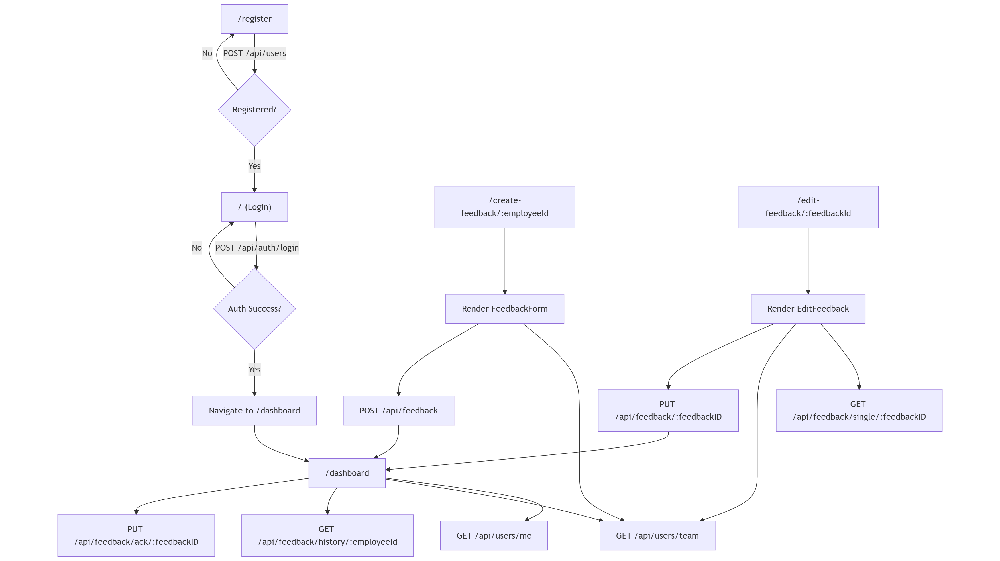

# nithin-dpdzero-feedback-system

A full-stack web application that enables structured employee feedback submission and review. The system supports role-based access for employees and managers, and includes features for creating, editing, and viewing feedback reports.

## Project Structure

```

.
├── backend/       # Flask backend with SQLite DB
└── frontend/      # React frontend with user login, dashboard, and feedback tools

```

---

## Frontend

Built with **React**, this part handles user authentication, feedback creation, and dashboard visualization.

### Available Routes

| Path | Component | Description |
|------|-----------|-------------|
| `/` | `LoginForm` | User login page |
| `/register` | `RegisterUser` | New user registration |
| `/dashboard` | `MainDashboard` | Main dashboard based on user role |
| `/create-feedback/:employeeId` | `FeedbackForm` | Form for managers to create feedback for employees |
| `/edit-feedback/:feedbackId` | `EditFeedback` | Edit existing feedback |

---

## Backend

Built with **Flask** and uses **SQLite** for data persistence. JWT is used for user authentication.

### API Endpoints

| Method | Endpoint | Description |
|--------|----------|-------------|
| `GET` | `/` | Health check or welcome route |
| `POST` | `/api/users` | Register a new user |
| `POST` | `/api/auth/login` | Authenticate user and return JWT |
| `GET` | `/api/users/me` | Get current authenticated user details |
| `GET` | `/api/users/team` | Get team members (for managers) |
| `POST` | `/api/feedback` | Create feedback for an employee |
| `GET` | `/api/feedback/history/<id>` | Get feedback history for a user |
| `PUT` | `/api/feedback/<id>` | Update a feedback entry |
| `GET` | `/api/feedback/single/<id>` | Get a single feedback by ID |
| `PUT` | `/api/feedback/ack/<id>` | Acknowledge feedback (employee action) |
| `GET` | `/api/dashboard/manager` | Manager dashboard data |
| `GET` | `/api/dashboard/employee` | Employee dashboard data |

---

## Here you can see the flowchart



---

## Getting Started

### Prerequisites

- Reactjs (for frontend)
- Python 3.10+ (for backend)
- pip
- SQLite

---

### Frontend Setup

```bash
cd frontend
npm i
npm run dev
```

---

### Backend Setup(pure Flask based)

```bash
cd backend
pip install -r requirements.txt
python app.py
```

### Backend Setup(Docker based)

```bash
cd backend
docker build -t feedback-backend .
docker run -it feedback-backend
```

---

## Environment Variables (Backend)

Use a `.env` file.

```env
FLASK_APP=app.py
FLASK_RUN_PORT=3000
JWT_SECRET_KEY=your-secret
```

## Environment Variables (Frontend)

Use a `.env` file.

```env
VITE_SERVER_API=your-backend-server-api
VITE_BASE_PATH="/"
```

---
